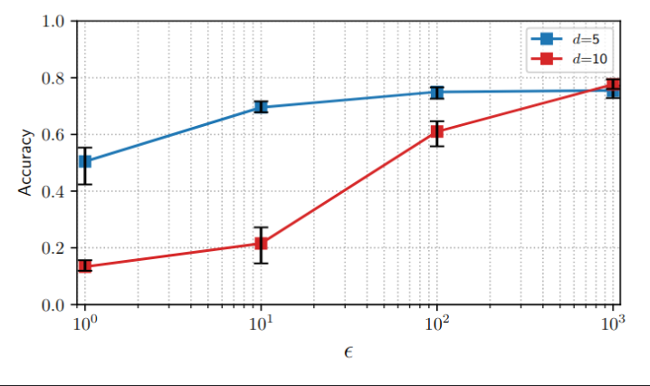
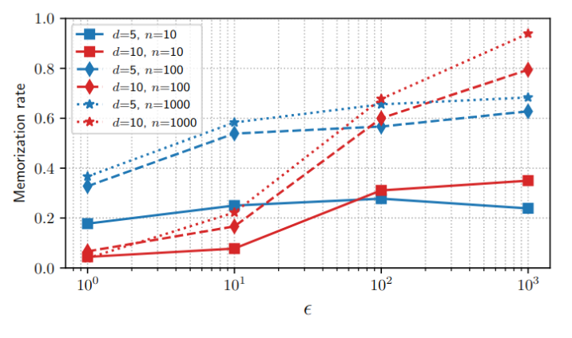
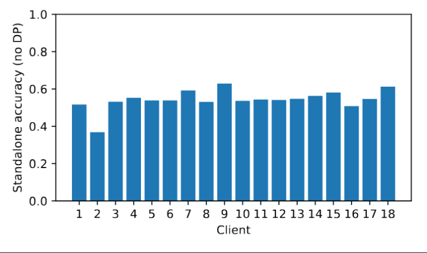

# Federated Forests with Differential Privacy

Code used in the paper "Federated Forests with Differential Privacy for Distributed Wearable Sensors ".

## Requirements 
- Numpy >= 1.26
- Pandas >= 2.1
- Matplotlib >= 3.8

<b>Note</b>: older versions of these libraries may also work but have not been tested

## Steps to reproduce the paper's results

1. Clone the repo and navigate to the main directory
2. Download the HuGaDB ZIP file from [here](https://github.com/romanchereshnev/HuGaDB/blob/master/HumanGaitDataBase.zip)
3. Run `bash setup.sh` if on Linux, or follow the instructions inside the `setup.sh` file if on Windows/MacOS
4. Run `python -m utils.split_dataset`
5. Run `python -m local training`
6. Run `python -m train_centralized`
7. Run `python -m train_federated_forests --epsilon <EPSILON> --max_depth <MAX_DEPTH>` (replace `<EPSILON> ` with 1, 10, 100, and 1000, and `<MAX_DEPTH>` with 5, and 10)
8. Run `python -m plot1_acc_vs_epsilon`:

8: Run `python -m plot2_privacy_vs_epsilon`:

9: Run `python -m plot3_standalone.py`:

